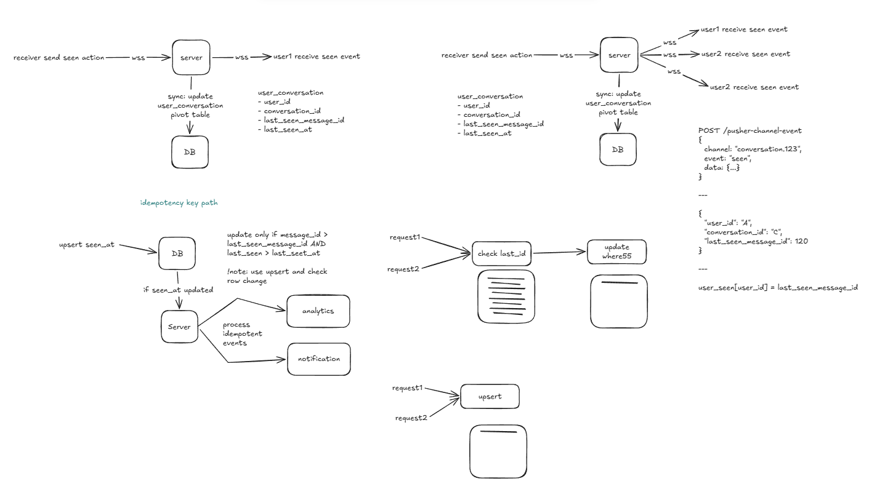

# System Design: Real-Time Chat System (WhatsApp/Messenger)

---

## 1. Requirements

### Functional

- One-to-one messaging
- Group messaging
- Real-time delivery (WebSocket)
- Offline message storage and sync
- Presence (online/offline/last seen)
- Message ordering per conversation
- Seen/delivery receipts (cursor-based, not per-message rows)

### Non-Functional

- Scalability: 100M+ users, ~300K writes/sec peak
- Availability: 99.9%+, multi-region
- Latency: <200ms for online delivery
- Consistency:
  - Strong ordering per conversation
  - Eventual consistency for delivery/fanout
  - Idempotent writes

---

## 2. High-Level Design

<!-- Add diagram link (Excalidraw or image) -->



Components:

- Client
  - Sends messages
  - Maintains WebSocket connection
  - Buffers out-of-order messages using sequence_id
- API Gateway / Chat API
  - Auth + validation
  - Idempotency check ((sender_id, message_id))
  - Produces event to queue (Kafka)
- Message Ingestion Service
  - Assigns ordering (either via Kafka partition OR sequence generator)
  - Persists message to DB
- Message Queue
  - Apache Kafka
  - Partitioned by conversation_id
  - Guarantees ordering per conversation
- Fanout Service
  - Consumes Kafka events
  - Resolves recipients
  - Pushes to WebSocket layer or inbox
- WebSocket Gateway
  - Maintains persistent connections
  - Pushes messages to online users
  - Tracks presence (Redis/pub-sub)
- Storage Layer
  - Message store (Cassandra/Bigtable-style)
  - Inbox store (per-user delivery state)
- Cache (Redis)
  - Presence
  - Recent messages
  - Active conversation metadata

---

## 3. Data Model

Entities:

User
Conversation
Message
UserConversation (seen cursor)

Example:

```json
{
  "message_id": "uuid",
  "conversation_id": "c123",
  "sender_id": "u1",
  "sequence_id": 1042,
  "created_at": "timestamp",
  "content": "hello"
}
```

Seen Cursor (IMPORTANT)

```json
{
  "user_id": "u1",
  "conversation_id": "c123",
  "last_seen_message_id": 1042,
  "last_seen_at": "timestamp"
}
```

👉 This avoids N² “seen per message” explosion.

---

## 4. API Design

Send message

```
POST /messages
```

```json
{
  "sender_id": "u1",
  "conversation_id": "c1",
  "message_id": "client-uuid",
  "content": "hello"
}
```

Fetch messages

```
GET /conversations/{id}/messages?cursor=...
```

WebSocket

```
WS /realtime/connect?user_id=...
```

Events

```json
{
  "type": "message",
  "conversation_id": "c1",
  "message": {...},
  "sequence_id": 1042
}
```

## 5. Deep Dive

### Scaling Strategy

Horizontal scaling

- Stateless API servers
- Kafka partitions by conversation_id
- WebSocket gateways horizontally scaled

Partitioning

- Message DB partitioned by conversation_id
- Kafka partition key = conversation_id

👉 Guarantees ordering per conversation

Hot partition problem

- Large groups → heavy traffic on one partition

Mitigation:

- switch to pull model
- split fanout (not ordering)
- prioritize recent messages

### Ordering (critical)

Two valid approaches:

Option A — Kafka-based ordering

- ordering = partition offset
- no explicit sequence generator
  Option B — sequence generator
- atomic counter per conversation
- DB or Redis increment

```sql
UPDATE conversation_counter
SET seq = seq + 1
RETURNING seq;
```

👉 Never use MAX(seq) + 1

### Idempotency

- client sends message_id (UUID)
- server enforces uniqueness: `(sender_id, message_id)`
- retries → safe

### Fanout

Push model

- WebSocket push to online users
- low latency

Pull model

- clients fetch messages
- used for large groups

Hybrid (production)

- small chats → push
- large groups → pull

### Caching

Redis for:

- presence
- recent messages
- active sessions

### Database Choice

NoSQL (Cassandra / Bigtable)

- high write throughput
- partition by conversation
- append-only pattern

Why not SQL?

- write contention at scale
- harder horizontal scaling

### Bottlenecks

- Hot conversations (celebrity groups)
- Fanout explosion (1 → 100K users)
- WebSocket connection limits
- Kafka partition skew

## 6. Tradeoffs

### Decision: Kafka + async fanout + per-conversation ordering

**Pros**

- Scales horizontally
- Decouples ingestion from delivery
- Strong ordering per conversation
- Fault-tolerant (replay, buffering)

**Cons**

- Eventual consistency in delivery
- Complex infra (Kafka + WS layer)
- Hot partitions still possible
- Slight reordering at client possible

## 7. Improvements

- Multi-region active-active routing
- Smarter fanout filtering (only active viewers)
- Message compression
- Adaptive batching
- Rate limiting for large groups
- Presence optimization (ephemeral vs durable)

## 🧪 Progress Log

### 05/05/2026

- exploring concept and depth

## Status

- 🟡 Learning

---

## Legend

- 🔴 Beginner
- 🟡 Learning
- 🟢 Comfortable
- 🔵 Mastered
