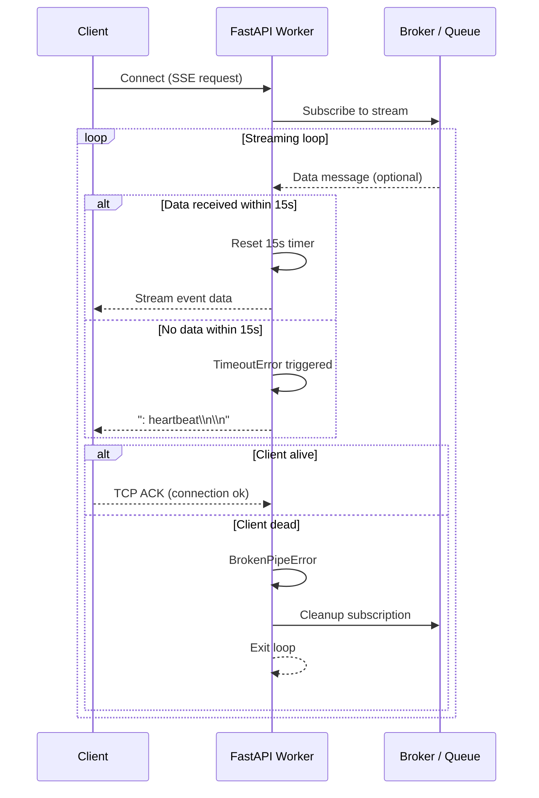

# RFC: SSE Manual Heartbeat and Dead Connection Detection

## 1. Overview

This document describes a heartbeat mechanism used in a Server-Sent Events (SSE) streaming system built with FastAPI. The goal is to detect silently disconnected clients and prevent resource leakage from long-lived but dead connections.

---

## 2. Problem Statement

SSE connections can fail silently when a client loses network connectivity (e.g., entering a tunnel, sleep mode, or network drop).

In such cases:

* The server is unaware of the disconnection.
* The backend broker or queue may stop producing messages.
* The server continues maintaining an idle connection.
* Resources remain allocated indefinitely to a “ghost” client.

---

## 3. Design Goals

The heartbeat mechanism is designed to:

* Detect silent client disconnects
* Avoid unnecessary resource usage
* Keep SSE connections lightweight
* Avoid introducing heavy polling or external monitoring systems

---

## 4. Solution: Timeout-Based Heartbeat Detection

A 15-second inactivity timer is applied around the SSE streaming loop.

### 4.1 Behavior Model

* If data is received from the queue → reset timer
* If no data is received within 15 seconds → trigger timeout

---

## 5. Timeout Handling Strategy (“Tap Test”)

When a `TimeoutError` occurs, the server sends a lightweight SSE comment as a connectivity probe.

### Heartbeat Payload

```text
: heartbeat\n\n
```

This is a valid SSE comment frame and is ignored by the browser.

---

## 6. Connection Validation Logic

### 6.1 Client Alive Case

1. Server sends heartbeat comment
2. Client acknowledges at TCP level
3. Connection remains open
4. Loop continues normally

---

### 6.2 Client Dead Case

1. Server attempts to send heartbeat
2. OS detects broken socket
3. `BrokenPipeError` is raised
4. FastAPI catches the exception
5. Streaming loop exits
6. Broker/subscription cleanup is executed

---

## 7. Sequence Diagram



---

## 8. Notes

* The heartbeat is intentionally minimal to reduce bandwidth overhead.
* SSE comments (`:` prefix) are used because they are ignored by clients but still maintain TCP activity.
* This mechanism doubles as both:

  * a keep-alive signal
  * a dead-connection detector

```py
import asyncio
from fastapi import FastAPI, Request
from fastapi.responses import StreamingResponse
import anyio

app = FastAPI()

# Simulated global broker (e.g., Redis Pub/Sub wrapper)
class MessageBroker:
    async def subscribe(self, topic: str):
        # In production, yield messages from your real broker
        count = 0
        while True:
            await asyncio.sleep(0.1)  # High throughput simulation
            yield f"data: Event {count}\n\n"
            count += 1

broker = MessageBroker()

@app.get("/stream")
async def stream_events(request: Request):
    # 1. Initialize a bounded queue to enforce backpressure limits
    # This prevents memory bloating if the TCP socket flushes slower than the broker pushes
    MAX_BUFFER_SIZE = 100
    queue = asyncio.Queue(maxsize=MAX_BUFFER_SIZE)
    
    topic = "live-updates"

    # 2. Define the background producer task
    async def broker_listener():
        try:
            async for message in broker.subscribe(topic):
                try:
                    # 'put_nowait' raises QueueFull if the client falls behind
                    queue.put_nowait(message)
                except asyncio.QueueFull:
                    # BACKPRESSURE STRATEGY: Drop the connection to protect server memory.
                    # Alternatively, use 'await queue.put(message)' to block the broker 
                    # listener, but only if the subscription is exclusive to this client.
                    print(f"Client buffer full. Evicting slow client.")
                    break
        except asyncio.CancelledError:
            # Task cleanup when cancelled by the connection closing
            pass

    # 3. Define the generator that yields to the HTTP response pipe
    async def event_generator():
        # Start the background listener within the request's context
        async with anyio.create_task_group() as tg:
            tg.start_soon(broker_listener)
            
            try:
                while True:
                    # Check if client disconnected before waiting for the next item
                    if await request.is_disconnected():
                        break
                        
                    try:
                        # 4. Enforce a heartbeat timeout while waiting for data
                        # If no event arrives within 15s, send a heartbeat to test the socket
                        async with anyio.fail_after(15.0):
                            message = await queue.get()
                            yield message
                            queue.task_done()
                    except TimeoutError:
                        # Send an SSE comment acting as an application-level heartbeat
                        # If the socket is dead/half-open, this write will trigger an exception
                        yield ": heartbeat\n\n"
                        
            except (asyncio.CancelledError, Exception) as e:
                print(f"Stream interrupted: {type(e).__name__}")
            finally:
                # 5. Clean up step: Stop the broker background listener
                tg.cancel_scope.cancel()
                print("Connection closed cleanly. Upstream listener torn down.")

    return StreamingResponse(event_generator(), media_type="text/event-stream")
```
